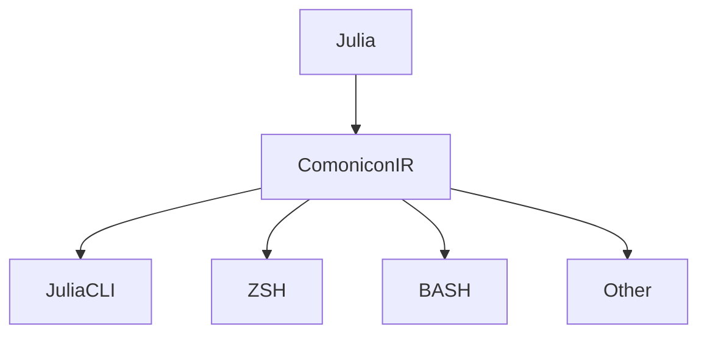

# Comonicon

命令行界面生成器

## 功能

- 定义命令行界面
    - 基础版本
    - 命令行工程
    - 将配置文件变成命令行界面
- 产生对应shell的自动补全
- 打包并配置命令行程序

---
layout: two-cols
---

# 定义命令行界面

尽管Comonicon的实现要比前几个包更加复杂，但是它的使用更加简单，
你只需要知道两个宏 `@cast` 和 `@main`, 右边是一个极简的例子

<v-click>

更加详细的使用方法请参考我在JuliaCon2022的演讲，由于时间原因
我们将不在这里讨论Comonicon的使用

<iframe width="400" height="225" src="https://www.youtube.com/embed/aXocCnO1w0k" title="YouTube video player" frameborder="0" allow="accelerometer; autoplay; clipboard-write; encrypted-media; gyroscope; picture-in-picture" allowfullscreen></iframe>

</v-click>

::right::

```julia
"""
ArgParse example implemented in Comonicon.

# Arguments

- `x`: an argument

# Options

- `--opt1 <arg>`: an option
- `-o, --opt2 <arg>`: another option

# Flags

- `-f, --flag`: a flag
"""
@main function main(x; opt1=1, opt2::Int=2, flag=false)
    println("Parsed args:")
    println("flag=>", flag)
    println("arg=>", x)
    println("opt1=>", opt1)
    println("opt2=>", opt2)
end
```

---

## 基于Expronicon的代码生成器

Comonicon是一个从Julia表达式到多种其它语言的代码生成器



而这个package本身也以编译器的方式进行设计，
这使得我们可以添加很多很有用，但是非常符合直觉的功能。

---
layout: two-cols
---

## 和Configurations一起使用

很多机器学习，或者数值模拟任务里需要大量进行不用参数的实验，
这个时候拥有**一个配置文件**会非常方便对实验进行记录，
但是同时我们会有需要**部分调整配置文件参数的需要**。

Comonicon作为一个编译器能够理解被`@option`定义的类型
从而将其转化为对应的命令行界面

```sh
➜ Comonicon git:(main) ✗ julia --project main.jl run --config.c=2
config = OptionB(OptionA(2, 2), 2)
```

::right::

```julia
using Comonicon
using Configurations

@option struct OptionA
    a::Int = 2
    b::Int = 2
end

@option struct OptionB
    option::OptionA = OptionA()
    c::Int
end

"""
# Options

- `-c, --config <path/to/option/or/specific field>`: config.
"""
@cast function run(;config::OptionB)
    @show config
end

@cast function rundef(;config::OptionA=OptionA())
    @show config
end

@main
```